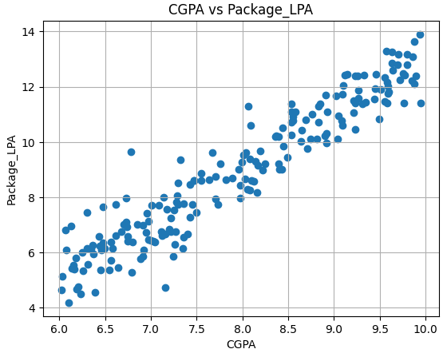
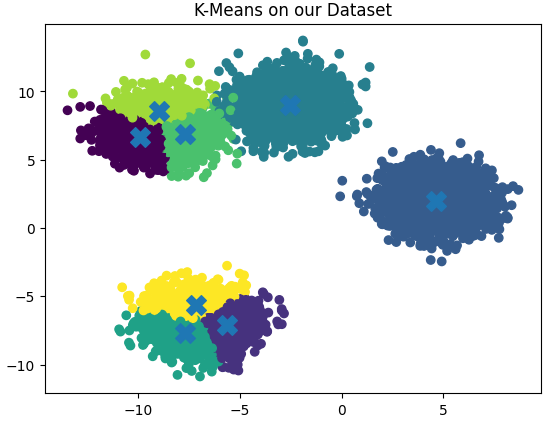

<div align="center">
  
# 🎓 Academic-Analytics & EDA
*A 4-Day Python Workshop Project for Data Cleaning, Analysis, and Machine Learning*


[](#)
[](#)
[](#)
[](#)

</div>

---

## 🌟 About the Project
This repository contains the code and resources from a 4-day intensive Python workshop. It explores fundamental data analysis concepts, from raw data manipulation to applying basic Machine Learning algorithms. 

**Key areas covered:**
- Data cleaning and preprocessing with **Pandas**
- Analytical operations and matrix mathematics with **NumPy**
- Data Visualization and Machine Learning clustering techniques.

---

## 📊 Visualizations & Insights

Here are some highlights of the data analysis performed in this project:

### 1️⃣ Placement Analysis (CGPA vs Package)
This scatter plot demonstrates the relationship between a student's **CGPA** and the **Salary Package (LPA)** offered. It shows a clear upward trend, indicating that higher grades generally correlate with better placement packages.

<div align="center">
  
</div>

### 2️⃣ Student Clustering (K-Means)
Using the **K-Means Clustering** algorithm, the dataset was grouped into distinct clusters based on hidden patterns. The 'X' marks the center (centroid) of each cluster, helping us categorize data points (like students) into similar groups.

<div align="center">
  
</div>

---

## 🚀 Getting Started

To explore the notebooks locally:

1. Clone the repository.
2. Ensure you have the required libraries installed:
   ```bash
   pip install numpy pandas matplotlib scikit-learn plotly
   ```
3. Run the Jupyter Notebooks:
   ```bash
   jupyter notebook
   ```

<div align="center">
  <i>Built with ❤️ during the Python Workshop</i>
</div>
